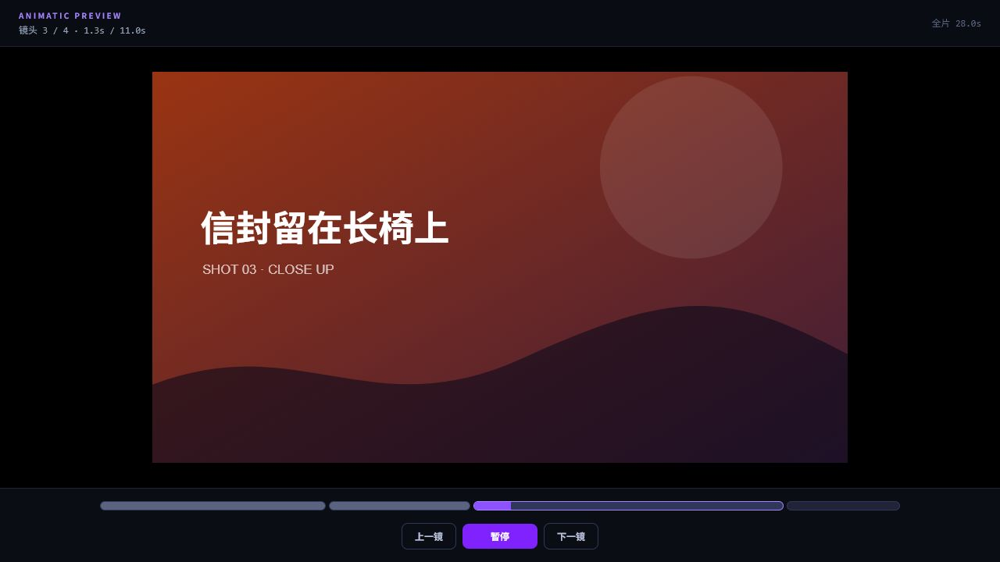
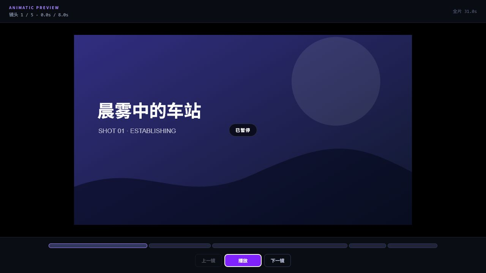
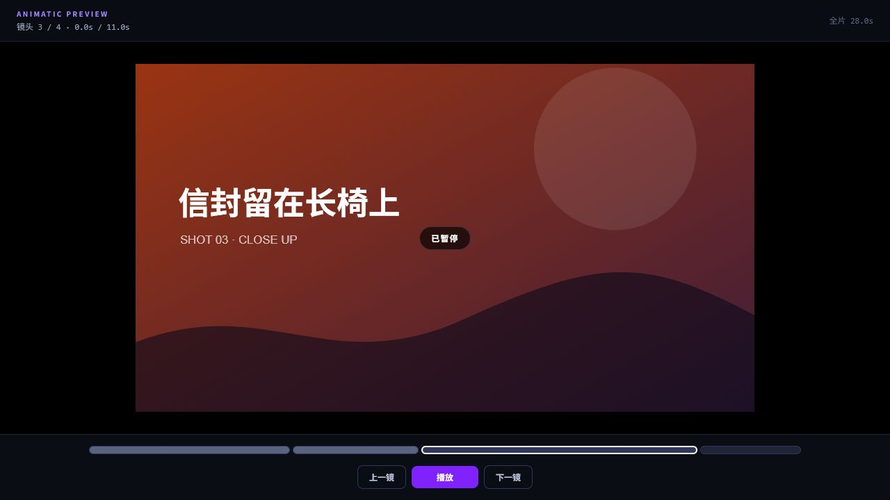
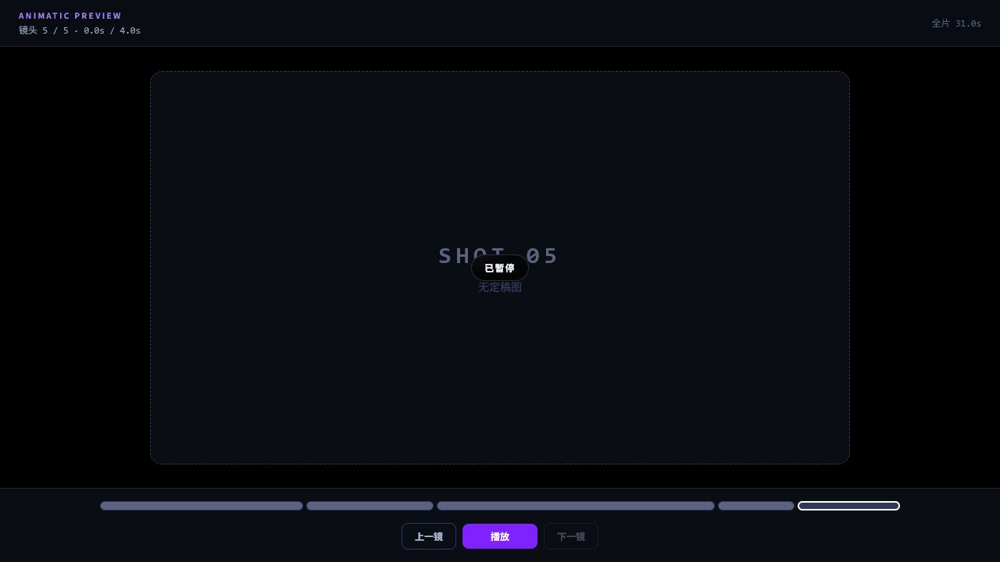

# WP-Animatic 验收证据

- 基线：`226ec80`
- 分支：`feat/animatic`
- 独立 worktree：`C:\Users\Owner\Documents\GitHub\wt-animatic`
- 结论：**PASS**

## 交付范围

- `src/components/animaticPlaylist.ts`
  - 导出 `AnimaticItem`、`buildAnimaticPlaylist`。
  - 图片按 `finalizedImageUrl ?? generatedImageUrl ?? imageUrl` 取值。
  - 缺失、非有限或非正 `durationSec` 兜底为 3 秒。
  - 缺 `shot.id` 的分镜跳过；legacy `shot.videoUrl` 不透传。
  - 导出播放器使用的纯函数 `nextIndex`、`previousIndex`、`elapsedToShot`。
- `src/components/AnimaticPlayer.tsx`
  - 播放/暂停、上一镜/下一镜、按时长加权的可点击分段时间轴。
  - 显示镜头序号、当前镜头进度、镜头时长与全片总时长。
  - 图片、视频、无定稿图占位三种媒体分支。
  - 视频 `onEnded` 推进，`durationSec` 同时作为超时兜底。
  - 支持 `activeShotId` 反向跳转及 `onShotChange` 正向联动。
  - 暂停冻结计时；卸载/切镜时清理 interval。

## 自动化门禁

### TypeScript

```text
> npm run lint
> tsc --noEmit

PASS
```

### 生产构建

```text
> npm run build
> vite build --configLoader runner

✓ 2087 modules transformed.
✓ built in 2.74s
PASS
```

构建仅出现仓库既有的单 chunk 大于 500 kB 提示，不是构建失败。

### playlist 与播放器纯逻辑测试

命令：`npx tsx --test src/components/animaticPlaylist.test.ts`

```text
tests 7
pass 7
fail 0
duration_ms 184.7976
PASS
```

覆盖：图片优先级、3 秒时长兜底、缺 ID 跳过、legacy videoUrl 不透传、空数组、上一/下一镜边界、按总秒数定位加权分段。

## 浏览器可视与交互验收

临时将 demo 挂载到 `main.tsx`，在本地 Vite preview 中用浏览器实际操作；验收后已将 `main.tsx` 恢复到 `HEAD`，临时页面与预览进程均已关闭。

- 自动播放：4 镜 demo 从镜头 1 自动推进至镜头 4；`onShotChange` 日志依次记录 `shot-platform`、`shot-letter`、`shot-empty`。
- 暂停冻结：暂停后等待 700ms，标题时间文本前后均为 `0.0s / 4.0s`，结果 `pauseFrozen: true`。
- 分段跳转：点击第三段后立即显示 `镜头 3 / 4 · 0.0s / 11.0s`，第三段为 pressed。
- 上一/下一镜：在镜头 4 点击上一镜到镜头 3，再点击下一镜回到镜头 4；末镜下一镜按钮禁用。
- 占位卡：无 `imageUrl`/`videoUrl` 的 item 显示 `SHOT 05` 与“无定稿图”，仍保留 4 秒时长并可正常播放。
- 视频分支：手工构造 `videoUrl` item（1 秒静音媒体，`durationSec: 3`）。播放后 DOM 立即检测到 `<video>`，状态为 `muted: true`、`autoplay: true`、`paused: false`；1.634 秒后已推进到下一镜，早于 3 秒超时兜底，验证 `onEnded` 推进生效。

### 截图

播放中（4 镜时间轴，镜头 3 正在计时）：



暂停态（0.0 秒冻结，播放按钮可恢复）：



点击第三段跳转后：



无定稿图占位卡：



## 边界复核

- `src/main.tsx` 临时 demo 已恢复，最终零差异。
- 未修改 `App.tsx`、`server.ts`、`router.ts`、`types.ts` 或 `server/modules/**`。
- 未新增 npm 依赖，未修改锁文件。
- 未读写正式 `db.sqlite`，未创建或修改 `uploads/` 内容。
- 最终新增文件仅为任务书允许的两个源文件、playlist 测试、验收文档与四张截图。
